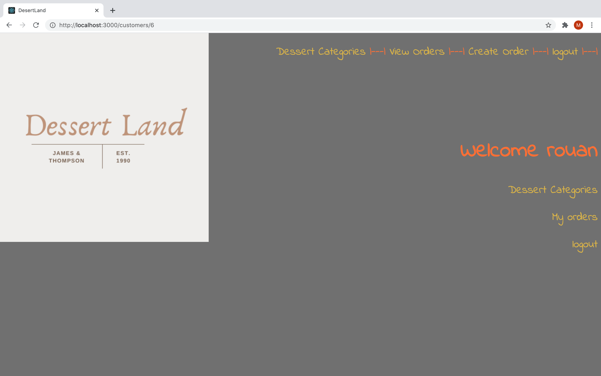

## Dessert Land

This is the repo for Dessert Land, an e-commerce app for bakery. 

### Tech Stack

* Ruby on Rails
* PostgreSQL DB

### Clone the repo, cd into the folder and run the following commands to start Rails server.

* bundle install
* rails db:create
* rails db:migrate
* rails s -p 3000